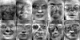

#Eigenface人脸识别

#### Eigenface人脸识别算法

> 自己写代码实现Eigenface人脸识别的训练与识别过程

> 1. 假设每张人脸图像只有一张人脸，且两只眼睛位置已知（即可人工标注给出）。每张图像的眼睛位置存在相应目录下的一个与图像文件名相同但后缀名为txt的文本文件里，文本文件中用一行、以空格分隔的4个数字表示，分别对应于两只眼睛中心在图像中的位置；
> 2. 实现两个程序过程（两个执行文件），分别对应训练与识别
> 3. 训练程序格式大致为： “mytrain.exe 能量百分比 model文件名 其他参数…”，用能量百分比决定取多少个特征脸，将训练结果输出保存到model文件中 。同时将前10个特征脸拼成一张图像，然后显示出来。
> 4. 识别程序格式大致为： “mytest.exe 人脸图像文件名 model文件名 其他参数…”，将model文件装载进来后，对输入的人脸图像进行识别，并将识别结果叠加在输入的人脸图像上显示出来，同时显示人脸库中跟该人脸图像最相似的图像。

## 一、开发软件说明
### 开发环境
- Ubuntu 14.04
- cmake 2.8.12.2
- opencv 3.0

## 二、算法具体步骤
#### 2.1 图像的归一化预处理
- 需要先对att人脸库以及自己的人脸进行预处理
- 保证眼睛的位置、间距一致，图像的大小一致
- 对图像进行灰度值归一处理
- 裁减图像中的键盘事件
	- '-' 缩小图片
	- '+' 放大图片
	- 'n' 取att某文件夹下的下一个图片（同一个人脸）
	- 'r' 复原图片
	- 'enter' 确认，进行下一步，灰度归一处理
	- up, down, left, right 移动矩形模版
- 保存预处理完的图片时，图片的名称就是这个人的名字/ID
- 因为之后计算速度的原因，所以每个图片的尺寸是20*25

#### 2.2 训练：建立人脸库
- 加载预处理完的41个人脸
- 建立41 * 500大小的图像矩阵
	
#### 2.3 训练：计算均值矩阵和协方差矩阵
- cvCalcCovarMatrix函数计算均值矩阵和协方差矩阵

#### 2.4 训练：计算协方差矩阵的特征向量
- cvEigenVV函数计算协方差矩阵的特征向量（即特征脸）
- 将特征值最大的10个特征脸显示出来并拼成一个图

#### 2.5 训练：根据特征向量生成映射空间A

#### 2.6 训练：将人脸库中的人脸映射到空间A并保存其坐标

#### 2.7 识别： 读入人脸库数据

#### 2.8 识别： 读入预处理之后的待测试人脸的数据

#### 2.9 识别： 将待测试人脸映射到空间A并保存其坐标

#### 2.10 识别： 比较待测试人脸在空间A的坐标到人脸库中的脸在空间A的坐标的欧式距离，距离最近的即为识别结果

## 三、算法实现要点
#### 3.1 图像的归一化预处理

#### 3.2 训练：建立人脸库

	
#### 3.3 训练：计算均值矩阵和协方差矩阵

#### 3.4 训练：计算协方差矩阵的特征向量

#### 3.5 训练：根据特征向量生成映射空间A

#### 3.6 训练：将人脸库中的人脸映射到空间A并保存其坐标

#### 3.7 识别： 读入人脸库数据

#### 3.8 识别： 读入预处理之后的待测试人脸的数据

#### 3.9 识别： 将待测试人脸映射到空间A并保存其坐标

#### 3.10 识别： 比较待测试人脸在空间A的坐标到人脸库中的脸在空间A的坐标的欧式距离，距离最近的即为识别结果

## 四、实验结果展示及分析
#### 4.1 预处理
- 处理Att人脸库

- 处理自己的脸

- 预处理完的人脸库

#### 4.2 训练

- 均值脸

- 前10个特征脸

#### 4.3 识别
- 待识别的图片

- 识别结果(取前5个)

